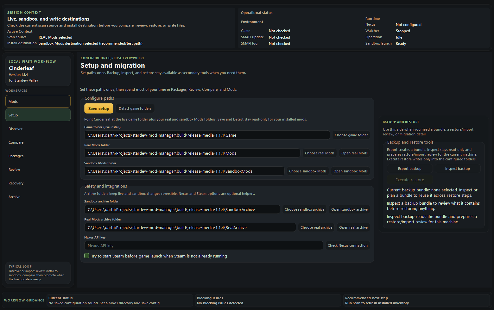
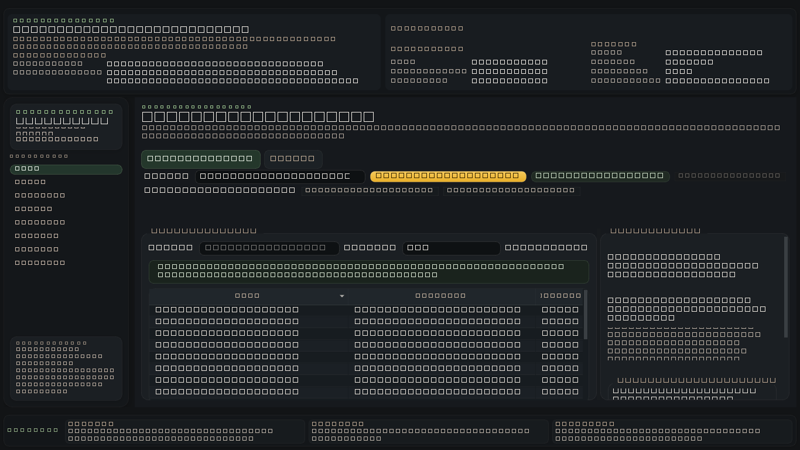
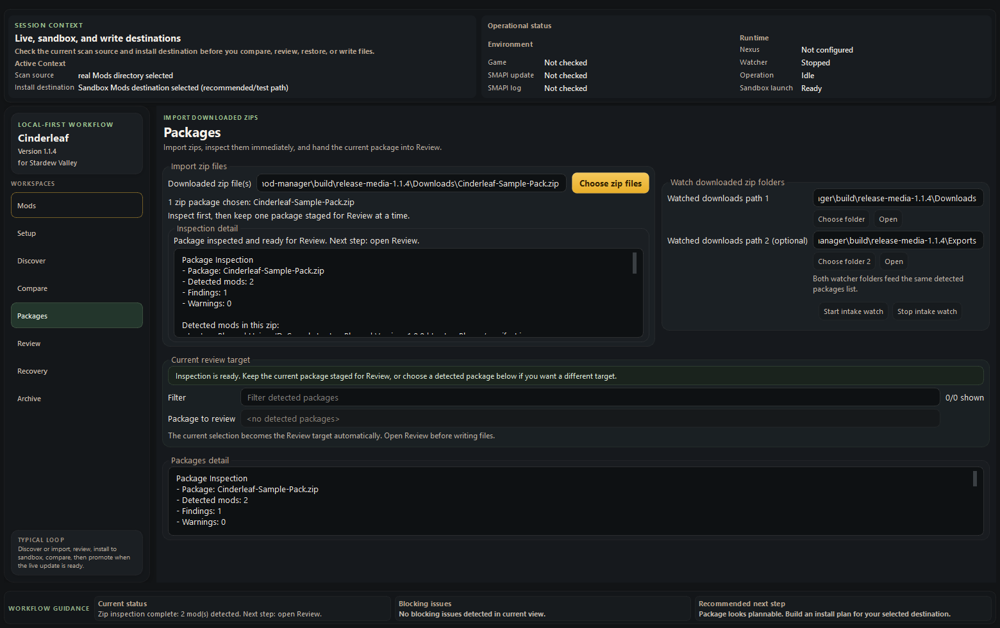

# Cinderleaf

**Cinderleaf** is a local-first mod workflow manager **for Stardew Valley**. It helps careful Windows players inspect downloaded mods, review installs before writing files, compare live and sandbox environments, and keep recovery paths available when something goes wrong.

`for Stardew Valley` is a descriptive subtitle, not an official affiliation. Cinderleaf is an independent community tool and is not affiliated with or endorsed by ConcernedApe.

Current release candidate prepared in this branch: **1.1.5**

## Why use it

- review installs before any write happens
- keep sandbox work separate from live `Mods`
- compare real vs sandbox drift without turning Compare into a write surface
- export backup bundles and inspect/plan restore work before execution
- preserve reversible workflows with archive and recovery support

## Screenshots







## Requirements

- Windows
- Stardew Valley
- SMAPI for most modded setups

## Download the portable build

The supported public build is a Windows portable zip published to GitHub Releases.

1. Open the repository's GitHub Releases page.
2. When the `1.1.5` GitHub Release is published, download `cinderleaf-1.1.5-windows-portable.zip`.
3. Extract it to a normal folder.
4. Run `Cinderleaf.exe`.

If a checksum file is published with the release, verify `cinderleaf-1.1.5-windows-portable.zip.sha256` before announcing or mirroring the build.

Current release caveats:

- this is a portable folder, not an installer
- Windows reputation prompts are still expected because code signing is not in place yet
- auto-update is not implemented yet

## Recommended workflow

1. Set your game folder, real `Mods`, and sandbox `Mods` in `Setup`.
2. Use `Discover` and `Packages` to inspect downloaded zips.
3. Review the current package in `Review` before applying anything.
4. Install to sandbox first.
5. Use `Compare` to inspect drift between real and sandbox.
6. Promote selected sandbox mods into real `Mods` only when you are ready.
7. Use backup, restore, archive, and recovery tools before larger changes or machine migration.

If you are not sure which destination to use, use the sandbox.

## Build from source

```powershell
py -3.12 -m venv .venv
.\.venv\Scripts\python.exe -m pip install -U pip
.\.venv\Scripts\python.exe -m pip install -e ".[dev,build]"
.\.venv\Scripts\python.exe -m pytest tests\unit -q
.\.venv\Scripts\python.exe scripts\build_windows_portable.py
```

The build script produces:

```text
dist\cinderleaf-1.1.5-windows-portable\
dist\cinderleaf-1.1.5-windows-portable.zip
dist\cinderleaf-1.1.5-windows-portable.zip.sha256
```

## Current limitations

- downloads are still manual
- Compare is intentionally read-only; it does not sync, promote, or write
- restore/import conflict handling is archive-aware and folder-oriented; file-level merge is not implemented
- there is no one-click "sync everything back to real" flow
- profile and instance management are out of scope
- Windows is the primary supported desktop path today

## Feedback and issue reporting

- use GitHub Issues for bugs and feature requests
- include the app version, Windows version, and whether the issue happened in real `Mods`, sandbox `Mods`, compare, or restore/import flow
- if the problem is install- or recovery-related, include the review summary or error text shown by the app
- code contributions and pull requests are not being actively accepted right now

## License

Cinderleaf is **source-available**, not open source.

This repository is licensed under **PolyForm Noncommercial 1.0.0**. You can use, modify, and redistribute it for noncommercial purposes under the terms in [LICENSE](LICENSE).

## Project files

- [CHANGELOG](CHANGELOG.md)
- [Feedback and issue notes](CONTRIBUTING.md)
- [License](LICENSE)
